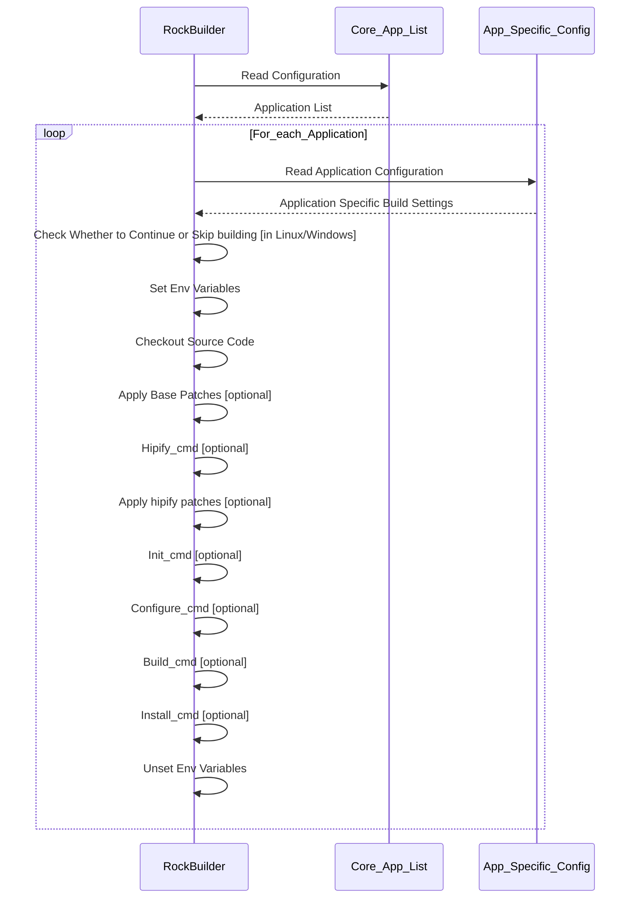

# RockBuilder Configuration

RockBuilder uses configuration files to specify the list of projects to be built.
Each project also has its own configuration file, which specifies build-related parameters.

RockBuilder configuration files use an INI-style format with section names
and key-value pairs, which are supported by tools such as Python’s `ConfigParser` module.

Example RockBuilder Command Execution Sequence:



## Core Project List Configuration

The **Core Project List** specifies the applications that RockBuilder will build by default. It is defined in the following file:

```
projects/core_apps.pcfg
```

Example content of the file specifying four applications to be built by default:

```
[projects]
project_list=
    pytorch
    pytorch_vision
    pytorch_audio
    torch_migraphx
```

## Application Configuration

Each application has its own INI-format configuration file that defines build options under the `[project_info]` section.

Build options can be categorized into the following:

- Application Base Information
- Environment Variables
- Build Phase Commands
- CMake Build Support

Depending on the application, build options for Linux and Windows may be the same or different. RockBuilder supports both via configuration files.

### Application Base Information

Application base information settings are mandatory. They specify the project name, source code repository URL and the project version to be checked out, built, and installed.

Example of core mandatory settings:

```
[project_info]
name=pytorch
repo_url=https://github.com/pytorch/pytorch.git
version=v2.7.0
```

You can also specify whether to skip building the project on Linux or Windows using the following optional settings:

```
skip_linux=1
skip_windows=1
```

### Environment Variables

RockBuilder supports the use of environment variables in application configuration settings.

These variables are set for each project when its build process starts, and are then reset to their original values once the build process finishes.

#### Base Environment Variables

Base environment variables are automatically specified for each application that are build. These variables can be referenced in the project-specific configuration files:

- `ROCM_HOME`:
  The ROCm SDK install prefix directory
- `ROCK_BUILDER_APP_SRC_DIR`:
  The source code directory for the currently built application
- `ROCK_BUILDER_APP_BUILD_DIR`:
  The build directory for the currently built application

#### Application-Specific Environment Variables

You can also define additional project-specific environment variables, such as those for selecting a compiler or enabling/disabling build features.

RockBuilder will first set common environment variables (if defined), followed by OS-specific settings (Linux/Windows).

Example:

```
env_common  = USE_ROCM=1
env_windows = USE_FLASH_ATTENTION=1
env_linux   = USE_FLASH_ATTENTION=0
```

### Build Phase Commands

In addition to supporting configure, build, and install phases for CMake-based projects, RockBuilder allows defining **custom build phase commands**.

The following optional build phase commands are supported:

- `clean_cmd`
- `hipify_cmd`
- `init_cmd`
- `pre_config_cmd`
- `config_cmd`
- `post_config_cmd`
- `build_cmd`
- `install_cmd`
- `post_install_cmd`

Each command can be a single command or a sequence of commands.

Example:

```
init_cmd = python -m pip install -r ./requirements.txt
clean_cmd = python setup.py clean
hipify_cmd = python tools/amd_build/build_amd.py
build_cmd = python setup.py bdist_wheel
```

Example of a sequence of commands:

```
install_cmd = cd ${ROCM_HOME}/share/amd_smi
              pip install .
```

#### Command Execution Directory

By default, build phase commands are executed from the root directory of the project’s source code.
You can override this by specifying the `cmd_exec_dir` in the configuration:

```
# Execute from the 'py' subdirectory
cmd_exec_dir=${ROCK_BUILDER_APP_SRC_DIR}/py
```

#### Note About the HIPIFY Command

The `hipify_cmd` is somewhat special compared to other commands.
It is partially tied to the source code checkout phase, where patches are split into:

- Base patches (applied immediately after checkout)
- HIPIFY patches (applied after the hipify command is run)

If a hipify command is specified, the execution flow is:

1. Source code checkout
1. Tagging of source code base
1. Applying base patches
1. Executing `hipify_cmd`
1. Tagging HIPIFY patches

The ROCm SDK provides a hipify tool that converts CUDA files and APIs to ROCm-compatible equivalents.
Some projects, like PyTorch, provide their own HIPIFY command.

Example from the PyTorch project:

```
hipify_cmd = python tools/amd_build/build_amd.py
```

HIPIFIED patches are applied from the directory:

```
patches/<project_name>/<project_version>/<project_name>/hipified
```

#### Python Wheel Management

If a project generates a Python wheel package during its build,
RockBuilder provides a built-in command to help install and manage it:

```
ROCK_CONFIG_CMD__FIND_AND_INSTALL_LATEST_PYTHON_WHEEL <search-path>
```

This command:

1. Searches for the latest wheel in the specified path
1. Copies it to the `packages/wheels` directory
1. Installs it into the current Python environment

Note: Installing the Python wheel may be necessary to resolve build-time dependencies for other projects built later.

Example:

```
install_cmd = RCB_CMD__FIND_AND_INSTALL_LATEST_PYTHON_WHEEL ${ROCK_BUILDER_APP_SRC_DIR}/py/dist
```

### CMake Build Support

If project uses CMake, it is possible to specify the application specific cmake configuration options.

If cmake_config option is specified fro the project in configure file, it will indicate for the RockBuilder that it should also execute the configure, build and install commands by using the cmake.

CMake build command support does not prevent using also the phase commands in parallel. For example the amdsmi project consist of both from the c-code based library handled by the cmake and python specific code handled by the python installer.

Example:

```
cmake_config=-DCMAKE_INSTALL_PREFIX=${ROCM_HOME} ${ROCK_BUILDER_APP_SRC_DIR}
```
